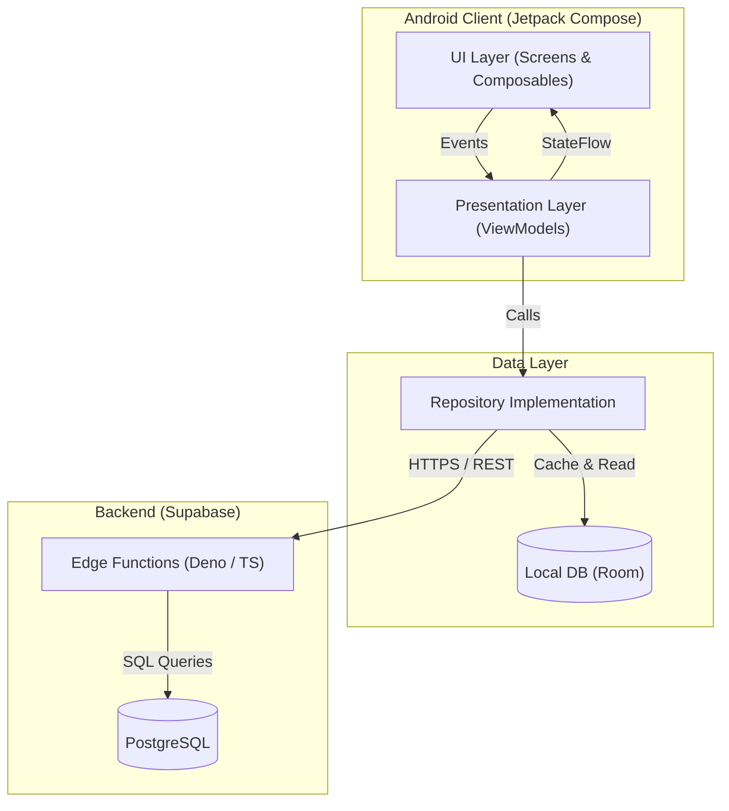
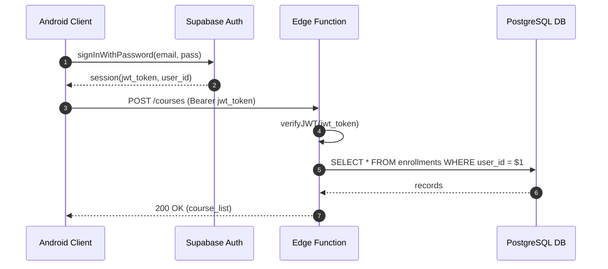
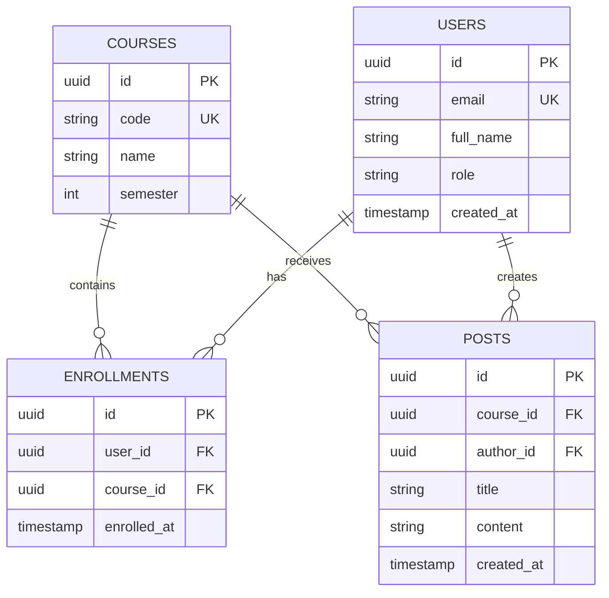
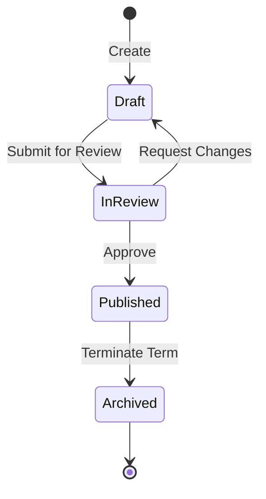

# Mermaid Diagramming for Software Engineering

Create professional, version-controlled software diagrams using Mermaid's text-based syntax. All diagrams render natively inside GitHub Markdown without external build steps, headless browsers, or binary image artifacts.

## Core Principles

1. **Text as Code**: Diagrams live directly inside Markdown files enclosed in ````mermaid```` code blocks. They are diffable, reviewable in Pull Requests, and easily maintained.
2. **Native GitHub Rendering**: Use only constructs supported natively by GitHub's Mermaid parser. Avoid non-standard extensions that require third-party renderers.
3. **Purposeful Visualization**: Every diagram must clarify architecture, workflows, or states. Never insert diagrams solely as decorative visual filler.
4. **Clean Technical Content**: Adhere strictly to the project policy prohibiting emojis, visual ornaments, or non-semantic symbols in diagram nodes and labels.
5. **Progressive Disclosure**: Keep diagrams focused and concise. Break complex architectures into multiple views rather than producing one unreadable mega-diagram.

## Diagram Selection Guide

| Need / Purpose | Recommended Type | Reference Guide |
|---|---|---|
| System architecture, component layers, cloud services | `flowchart TD` / `flowchart LR` with `subgraph` | [`references/architecture-diagrams.md`](references/architecture-diagrams.md) |
| API call flow, authentication, inter-service messaging | `sequenceDiagram` | [`references/sequence-diagrams.md`](references/sequence-diagrams.md) |
| Business processes, decision trees, workflow pipelines | `flowchart TD` | [`references/flowcharts.md`](references/flowcharts.md) |
| Database schema, Room entities, PostgreSQL tables | `erDiagram` | [`references/erd-diagrams.md`](references/erd-diagrams.md) |
| Lifecycle transitions, status progression, FSM | `stateDiagram-v2` | [`references/state-diagrams.md`](references/state-diagrams.md) |
| Domain model, Kotlin class hierarchies, contracts | `classDiagram` | [`references/class-diagrams.md`](references/class-diagrams.md) |
| Multi-agent orchestration, coordination workflows | `sequenceDiagram` or `flowchart TD` | [`references/sequence-diagrams.md`](references/sequence-diagrams.md) |

## Quick Syntax Cheat Sheet

### 1. Architecture Flowchart (GitHub-Compatible)


### 2. Sequence Diagram (Authentication Flow)


### 3. Entity-Relationship Diagram (ERD)


### 4. State Diagram (Post Publication Lifecycle)


## GitHub Native Rendering Guardrails

GitHub runs a strict client-side parser and DOM sanitizer. To ensure 100% rendering reliability on GitHub:

1. **Always Quote Node Labels with Special Characters**:
   - Correct: `node_a["User (Student)"]`
   - Incorrect: `node_a[User (Student)]` (parentheses break parsing).
2. **Never Use Reserved Keywords as IDs**:
   - In sequence diagrams, keywords `loop`, `alt`, `opt`, `end`, `par`, `rect` cannot be used as bare participant names.
   - Correct: `participant L as LoopComponent`
3. **No Semicolons in Message Text**:
   - Do not write: `App->>Server: Request; retry on fail` (semicolon truncates text or errors).
   - Write: `App->>Server: Request - retry on fail`
4. **Avoid `C4Context` / `C4Container` Syntax**:
   - GitHub does NOT bundle the Mermaid C4 extension.
   - Always represent architecture using `flowchart TD` or `flowchart LR` with `subgraph` blocks.
5. **No Interactive JavaScript**:
   - GitHub strips `click` events and custom JavaScript handlers.
6. **No Raw HTML or Complex Tags**:
   - Avoid `<b>`, `<br/>`, `<table>` inside nodes. Use plain text or Markdown line breaks.
7. **No Emojis or Pictographs**:
   - Never insert emoji characters in node names or connection labels.

For the exhaustive list of pitfalls and solutions, see [`references/github-rendering-guardrails.md`](references/github-rendering-guardrails.md).

## Diagram Quality & Readability Standards

1. **Orientation**:
   - Use `flowchart TD` (Top-to-Bottom) for hierarchical architectures, decision trees, and layered stacks.
   - Use `flowchart LR` (Left-to-Right) for pipelines, data ingestion, and sequential process phases.
2. **Component Density**:
   - Limit nodes per diagram to 12-18 elements. If a system has more, split it into Context, Container, and Component views.
3. **Line Crossings**:
   - Arrange subgraphs and node order to minimize edge crossings. Symmetrical layouts are easier to scan.
4. **Naming Consistency**:
   - Use exact class, table, and module names from the codebase (e.g. `CourseRepository`, `auth_accounts`).
5. **Meaningful Styling**:
   - Apply styling sparingly through `classDef`. Use high-contrast colors compatible with both GitHub Light and Dark modes.

## Documentation Agent Workflow

When generating documentation:

1. **Analyze Content**: Determine what concepts require visual representation.
2. **Select Diagram Type**: Use the Decision Guide table above.
3. **Draft Diagram**: Write valid, clean Mermaid code following the specific reference guide.
4. **Validate Syntax**: Check against GitHub guardrails (quoted labels, no reserved words, clean characters).
5. **Review Readability**: Verify edge flow, clear labels, and absence of visual clutter.
6. **Embed in Markdown**: Place within ````mermaid```` code fences directly in the target `Docs/*.md` document.

## Reference Modules

Load the matching reference from `references/` for deep dive patterns:

- [`references/architecture-diagrams.md`](references/architecture-diagrams.md): System architecture, layered designs, and cloud infrastructure.
- [`references/sequence-diagrams.md`](references/sequence-diagrams.md): API flows, auth sequences, and multi-agent coordination.
- [`references/flowcharts.md`](references/flowcharts.md): Process maps, logic branches, and workflow pipelines.
- [`references/erd-diagrams.md`](references/erd-diagrams.md): Database modeling, Room DB schemas, and relational keys.
- [`references/state-diagrams.md`](references/state-diagrams.md): Entity state machines and lifecycle progressions.
- [`references/class-diagrams.md`](references/class-diagrams.md): Domain modeling and OOP structures.
- [`references/github-rendering-guardrails.md`](references/github-rendering-guardrails.md): Complete GitHub compatibility rules.
