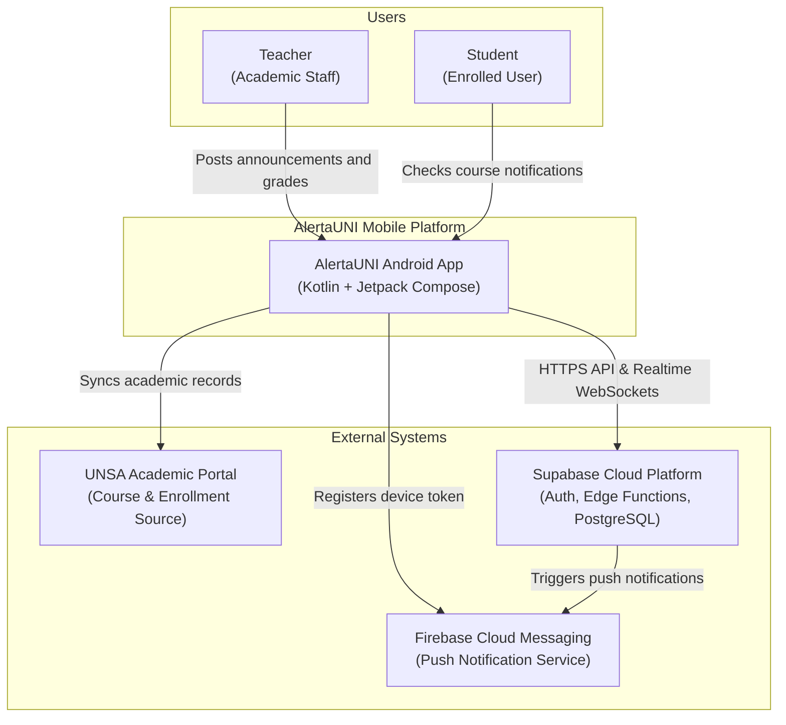
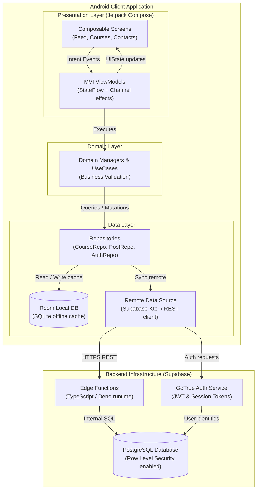
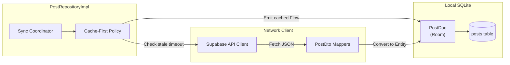

# Software Architecture Diagrams

This guide explains how to document system architecture, component layers, and cloud infrastructure using GitHub-compatible Mermaid syntax.

## Why Not Native C4 Directives?

GitHub Markdown does not bundle the `C4Context` or `C4Container` plugins. Attempting to use them produces broken code blocks. Instead, we use `flowchart TD` or `flowchart LR` with structured `subgraph` enclosures to achieve identical architectural clarity with 100% native GitHub compatibility.

## Architectural Levels

### Level 1: System Context Diagram

Visualizes the software system in its environment, including human users, external university systems, and third-party services.

### Level 2: Container / Layered Architecture Diagram

Decomposes the system into high-level deployment containers and architectural layers.

### Level 3: Component Diagram (Data Layer Internals)

Focuses on the internal composition of a specific subsystem, such as offline-first synchronization.

## Best Practices for Architecture Diagrams

1. **Direction**:
   - Use `flowchart TD` for layered architecture (Presentation on top, Data in middle, Database/Backend at bottom).
   - Use `flowchart LR` for data pipelines or horizontal service communication.
2. **Explicit Subgraphs**:
   - Always group related components using `subgraph ID["Label"]` syntax.
   - Use descriptive alphanumeric IDs for subgraphs and quoted labels for visual clarity.
3. **Database Representation**:
   - Use cylinder shape syntax `[("Database Name")]` for persistent stores (Room, PostgreSQL, Redis).
4. **Boundary Clarity**:
   - Clearly delineate process or network boundaries (e.g. On-Device vs Cloud Backend) through separate subgraphs.
