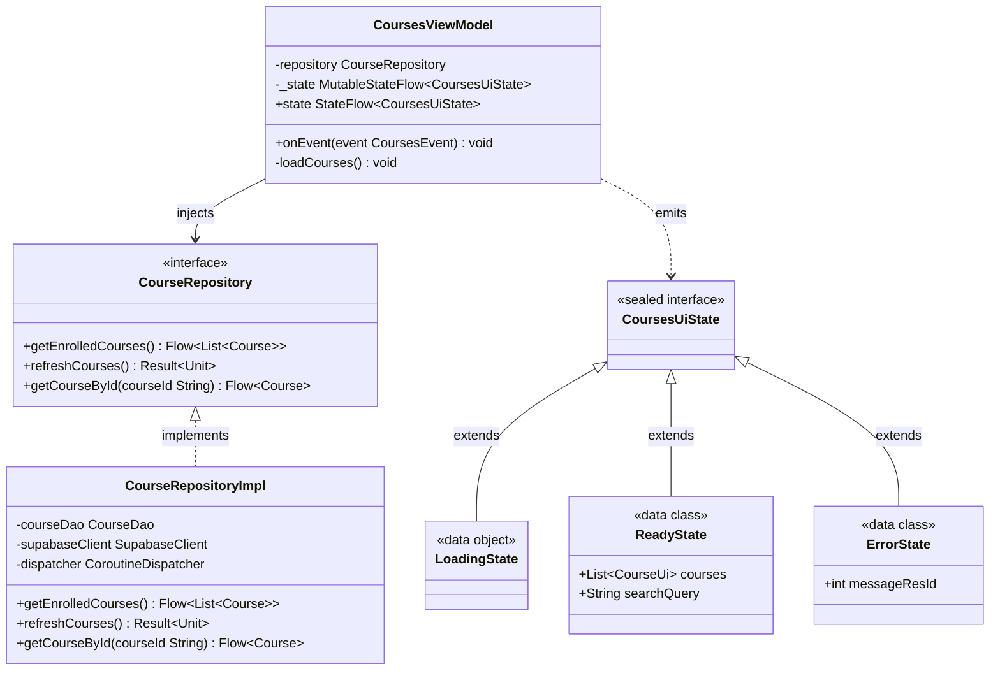

# Class Diagrams

Class diagrams illustrate object-oriented structure, class hierarchies, interfaces, and contracts within software modules. In Mermaid, declare class diagrams using `classDiagram`.

## Relationship Notation

| Syntax | Relationship Type | Meaning |
|---|---|---|
| `<|--` | Inheritance | Subclass extends Superclass |
| `<|..` | Realization | Class implements Interface |
| `*--` | Composition | Part cannot exist without Whole (strong ownership) |
| `o--` | Aggregation | Part can exist independently of Whole |
| `-->` | Directed Association | Class A holds reference to Class B |
| `..>` | Dependency | Class A uses Class B as parameter or return type |

---

## Example: AlertaUNI MVI & Repository Contract

Documents the Kotlin class hierarchy, interfaces, and MVI state patterns implemented in `AlertaUNI`.

---

## Best Practices for Class Diagrams

1. **Direction**:
   - Use `direction TB` (Top-to-Bottom) or `direction LR` (Left-to-Right) at the start of the diagram block to control flow.
2. **Generics Syntax**:
   - In Mermaid, write generics using tilde delimiters: `List~Course~` instead of `List<Course>` (angle brackets conflict with Mermaid relationship tokens).
3. **Stereotypes**:
   - Explicitly annotate roles using `<<interface>>`, `<<abstract>>`, `<<data class>>`, or `<<sealed interface>>`.
4. **Visibility Markers**:
   - Use `+` for public members, `-` for private fields, `#` for protected methods, and `~` for internal members.
