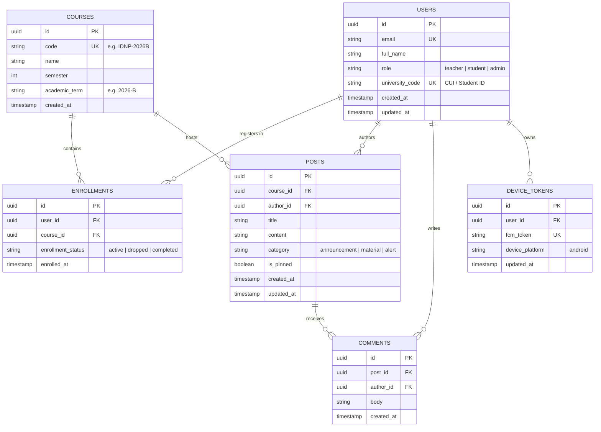

# Entity-Relationship Diagrams (ERD)

Entity-Relationship Diagrams model relational database schemas, table structures, keys, and foreign-key cardinalities. Mermaid provides native support via `erDiagram`.

## Cardinality Notation

Mermaid uses Crow's Foot notation for relationships:

| Notation | Left Side Meaning | Right Side Meaning | Typical Meaning |
|---|---|---|---|
| `||--||` | Exactly one | Exactly one | One-to-One mandatory |
| `||--o|` | Exactly one | Zero or one | One-to-One optional |
| `||--o{` | Exactly one | Zero or more | One-to-Many optional |
| `||--|{` | Exactly one | One or more | One-to-Many mandatory |
| `o|--o{` | Zero or one | Zero or more | Optional parent to many |

---

## Example: AlertaUNI Relational Schema

Models the core entities for academic communication, enrollments, announcements, and push token registrations across Supabase PostgreSQL and Room SQLite cache.

---

## Best Practices for ER Diagrams

1. **Entity Names**:
   - Use uppercase singular or plural nouns matching database tables (`USERS`, `COURSES`).
2. **Key Annotations**:
   - Always flag `PK` (Primary Key), `FK` (Foreign Key), and `UK` (Unique Key) after attribute names.
3. **Attribute Types**:
   - Use standard database data types (`uuid`, `string`, `int`, `boolean`, `timestamp`).
4. **Relationship Labels**:
   - Enclose relationship descriptors in double quotes: `||--o{ ENROLLMENTS : "registers in"`.
5. **No Emojis**:
   - Never use emoji icons in table headers or relationship text.
