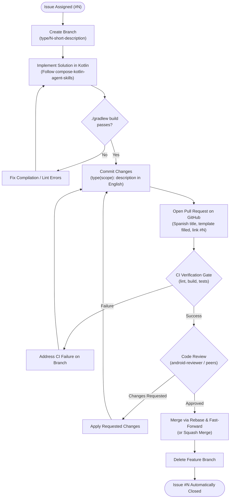
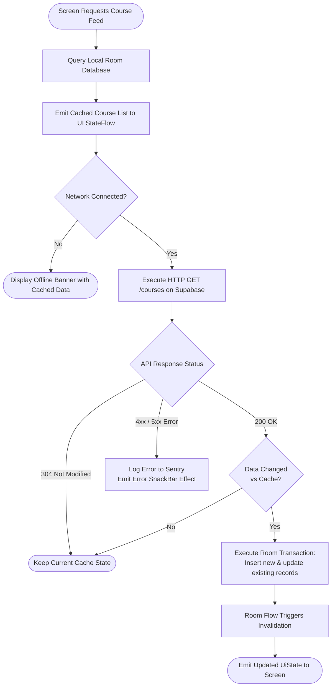

# Flowcharts & Process Workflows

Flowcharts visualize algorithms, business logic, user journeys, and engineering processes. In Mermaid, flowcharts are declared using `flowchart TD` (top-to-bottom) or `flowchart LR` (left-to-right).

## Standard Node Shapes

Always quote text inside non-standard shapes to prevent syntax breaks on GitHub:

| Shape Syntax | Appearance | Semantic Use Case |
|---|---|---|
| `id["Process Text"]` | Rectangle | Standard task, computation, or operation |
| `id(["Start / End"])` | Stadium | Entry points, start states, termination points |
| `id{"Condition?"}` | Rhombus / Diamond | Decision points with branching pathways |
| `id[("Database Store")]` | Cylinder | Persistent storage or local cache access |
| `id[/"Input or Output"/]` | Parallelogram | User input or external output data |
| `id(("Connector"))` | Circle | Phase markers or join points |

---

## Example 1: Git Team Development Workflow

Documents the mandatory lifecycle from GitHub Issue assignment to main branch merge defined in `CONTRIBUTING.md`.

---

## Example 2: Offline-First Data Synchronization Algorithm

Illustrates how AlertaUNI resolves local cache reads and background network synchronization.

---

## Best Practices for Flowcharts

1. **Explicit Branch Labels**:
   - Always label branching arrows exiting a decision node: `-->|Yes|` and `-->|No|`.
2. **Consistent Orientation**:
   - Standardize on `TD` (Top-to-Bottom) for hierarchical workflows and decision trees.
   - Use `LR` (Left-to-Right) only when the process is strictly linear and has few branches.
3. **Avoid Dangling Paths**:
   - Every condition path must eventually terminate at a designated terminal node or join a common resolution node.
4. **Clean Technical Text**:
   - Never use emojis or visual icons in node text or branch conditions. Use technical terms matching the codebase.
