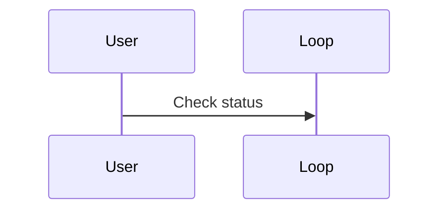

# GitHub Native Mermaid Rendering Guardrails

This guide documents the strict syntax rules and quirks required for 100% reliable rendering of Mermaid diagrams across GitHub Markdown, Issues, Pull Requests, Discussions, and GitHub Wikis.

## Known GitHub Renderer Quirks & Limitations

GitHub uses a client-side Mermaid parser combined with DOMPurify sanitization. Syntax that renders in local IDE plugins or specialized CLI tools may fail or render as blank space on GitHub if it encounters the following issues:

### 1. Label Quoting (The #1 Cause of Rendering Failures)

Whenever a node label contains punctuation or special characters, you **must** enclose the text in double quotes inside the bracket delimiters.

| Syntax Character | Bare Syntax (Fails on GitHub) | Quoted Syntax (Works on GitHub) |
|---|---|---|
| Parentheses `()` | `node[User (Teacher)]` | `node["User (Teacher)"]` |
| Square Brackets `[]` | `node[Array [0..N]]` | `node["Array [0..N]"]` |
| Hyphens / Dashes `-` | `node[Auth-Service]` | `node["Auth-Service"]` |
| Slashes `/` or `\` | `node[api/v1/auth]` | `node["api/v1/auth"]` |
| Colons `:` | `node[Port: 8080]` | `node["Port: 8080"]` |
| Question marks `?` | `cond{Authenticated?}` | `cond{"Authenticated?"}` |

### 2. Sequence Diagram Reserved Keywords

Never use reserved syntax keywords as unaliased participant IDs. The following identifiers cause silent parsing failures on GitHub:
- `loop`
- `alt`
- `opt`
- `par`
- `critical`
- `break`
- `end`
- `rect`

**Incorrect (fails silently on GitHub):**
```text
sequenceDiagram
    participant User
    participant loop
    User->>loop: Check status
```

**Correct:**


### 3. Semicolons in Message Text

In sequence diagrams, a semicolon `;` in a message description is treated as an end-of-statement delimiter and will truncate the label or fail to render.

**Incorrect:**
`Client->>Server: Request data; include headers`

**Correct:**
`Client->>Server: Request data - include headers`

### 4. C4 Model Syntax Is NOT Supported Natively

GitHub does **not** bundle Mermaid's C4 extension. Any block starting with `C4Context`, `C4Container`, `C4Component`, or `C4Deployment` will render as raw code or an error message.

**Rule:**
Always represent C4-style architecture using standard `flowchart TD` or `flowchart LR` with styled `subgraph` boundaries.

### 5. Interactive Features and Callbacks Are Disabled

GitHub's sanitizer removes:
- `click nodeId "https://..."`
- `click nodeId callback`
- Tooltips and popovers
- Dynamic JavaScript events

Do not design diagrams that rely on clickable nodes. Provide links in normal Markdown text above or below the diagram instead.

### 6. HTML Tags Inside Nodes

Do not use raw HTML tags such as `<b>`, `<i>`, `<br/>`, `<span>`, or `<div>` inside labels.
To insert line breaks inside a node label, use `\n` inside quoted strings:
`node["First Line\nSecond Line"]`

### 7. Strict Prohibition of Emojis and Ornaments

In adherence to the `clean-technical-content` policy:
- Do NOT use emojis or visual icons (such as folder, rocket, lock, or person pictographs) inside diagram labels or node names.
- Represent actors and entities using standard descriptive terms (e.g. `Student`, `Teacher`, `SupabaseEdgeFunction`, `AuthRepository`).

### 8. Theme and Color Contrast

GitHub renders in both Light and Dark themes. If you apply custom colors via `classDef` or `style`:
- Avoid hardcoding very dark background fills with black text (unreadable in dark mode).
- Avoid pure white fills with white text (unreadable in light mode).
- Use neutral border colors and distinct stroke styles (`stroke-dasharray`) to communicate state rather than low-contrast color washes.

Recommended safe class definitions:
```text
classDef default fill:#f9f9f9,stroke:#333,stroke-width:1px,color:#111;
classDef highlight fill:#e3f2fd,stroke:#1565c0,stroke-width:2px,color:#0d47a1;
classDef container fill:#f5f5f5,stroke:#9e9e9e,stroke-width:1px,stroke-dasharray: 4 4,color:#212121;
```
