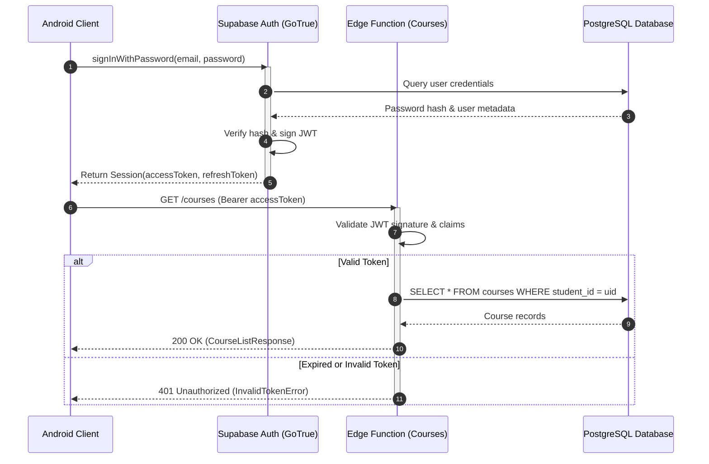
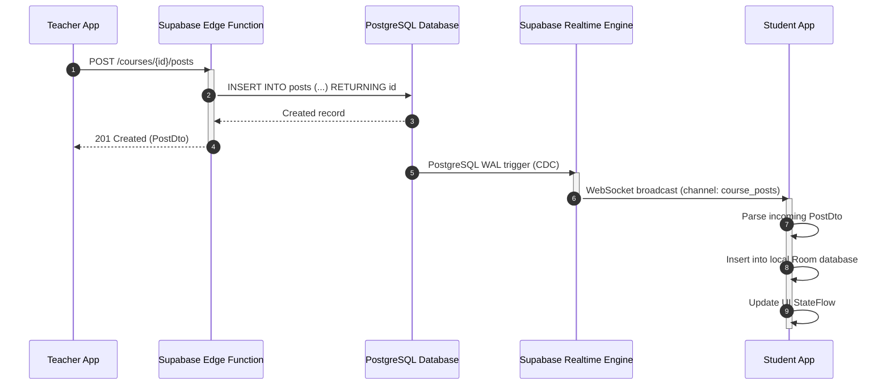
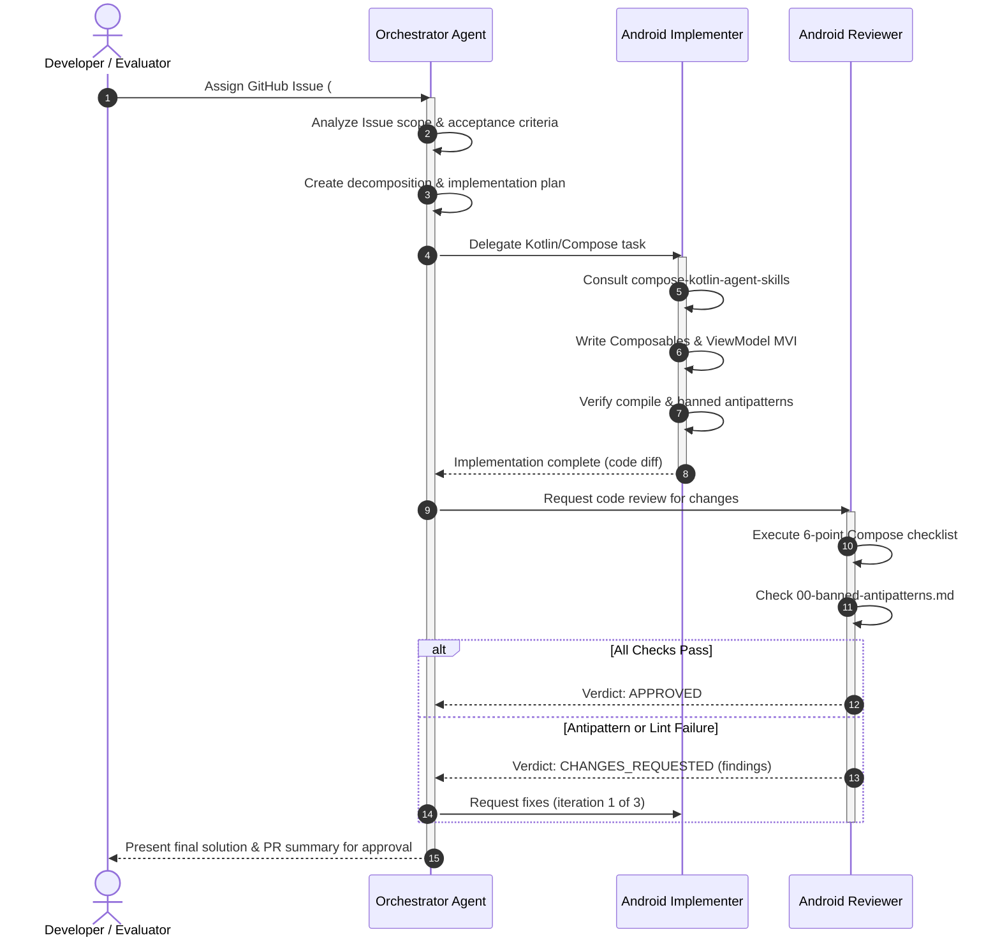

# Sequence Diagrams

Sequence diagrams illustrate interactions and message exchanges between participants over time. They are ideal for documenting API authentication lifecycles, realtime event broadcasting, and multi-agent coordination flows.

## Core Syntax Rules for GitHub

1. Use `autonumber` at the top of the diagram to make steps easy to reference in text discussions and PR reviews.
2. Define all participants explicitly with `participant ID as Label` at the beginning of the block to control column order.
3. Use solid arrows with filled heads `->>` for synchronous calls and open dashed arrows `-->>` for return messages.
4. Use `alt / else / end` blocks for branching logic (e.g. success vs error scenarios).
5. Never use reserved syntax words (`loop`, `alt`, `opt`, `end`, `par`) as participant identifiers.
6. Do not include semicolons `;` in message labels.

---

## Example 1: User Authentication & JWT Exchange

Documents how the Android client signs in against Supabase and retrieves protected course data.

---

## Example 2: Realtime Post Notification Flow

Shows how a new post created by a teacher propagates via Supabase Realtime to enrolled students.

---

## Example 3: Antigravity Multi-Agent Orchestration Flow

Illustrates how the project's AI subagents collaborate from requirement parsing to verified implementation.

---

## Best Practices for Sequence Diagrams

- **Focus**: Keep sequence diagrams strictly to one interaction flow or scenario. Do not combine disparate use cases into one diagram.
- **Activations**: Use `activate` and `deactivate` to explicitly show processing lifespans.
- **Notes**: Add explanatory context when necessary using `Note over Participant: Explanation`.
- **Clean Naming**: Ensure participant labels reflect accurate system roles (`Teacher App`, `PostgresDB`, `Orchestrator Agent`).
