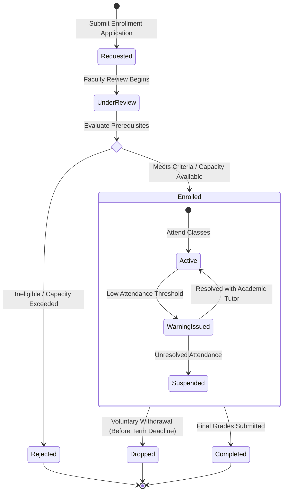
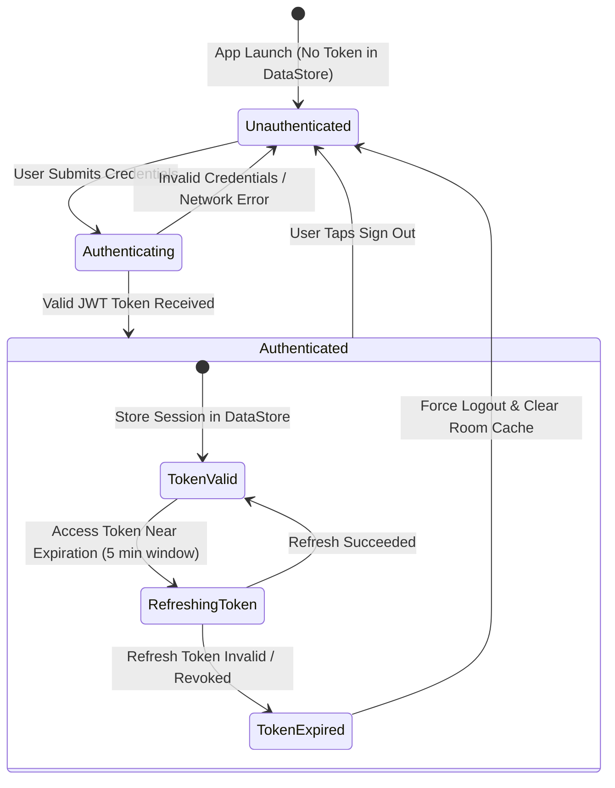

# State Diagrams

State diagrams model the lifecycle, status transitions, and finite state machines (FSM) of domain entities and user sessions. Always declare state diagrams using `stateDiagram-v2` for modern, clean visual rendering on GitHub.

## Core Syntax

- `[*] --> StateA`: Initial transition.
- `StateA --> StateB : Event / Condition`: Transition with triggering event.
- `StateB --> [*]`: Terminal transition.
- `state "Descriptive Label" as StateAlias`: Custom state descriptions.
- `<<choice>>`: Branching condition pseudostate.
- `note right of StateA`: Contextual explanations.

---

## Example 1: Student Enrollment Lifecycle

Documents the status progression of a student in an academic course.

---

## Example 2: Client Authentication & Session Lifecycle

Models the local session state machine managed by `SessionManager` in AlertaUNI.

---

## Best Practices for State Diagrams

1. **Use `stateDiagram-v2`**:
   - Always use version 2 (`stateDiagram-v2`). The legacy `stateDiagram` produces dated styling.
2. **Clear Event Triggers**:
   - Every transition arrow between named states should explain the cause (`: Event / Action`).
3. **Composite States for Sub-Lifecycles**:
   - Group nested or dependent states inside `state ParentState { ... }` blocks (e.g. `Enrolled` containing `Active` and `Suspended`).
4. **Always Define Terminal States**:
   - Ensure all failure, completion, or termination paths lead to a terminal state (`--> [*]`).
