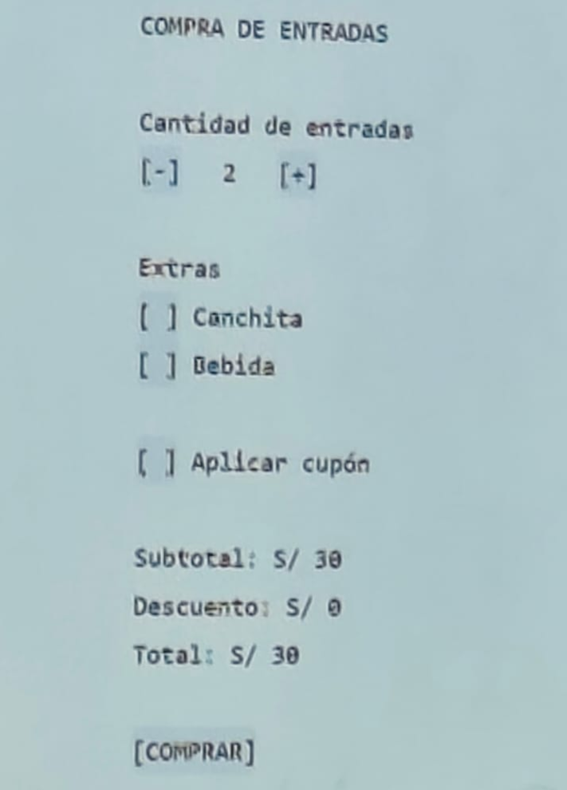
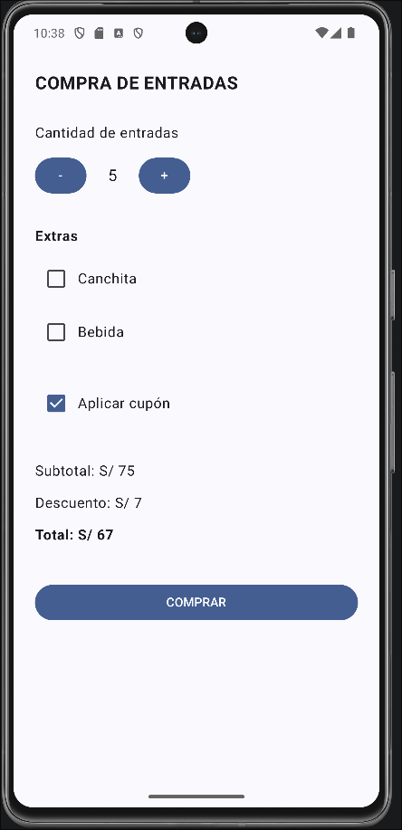
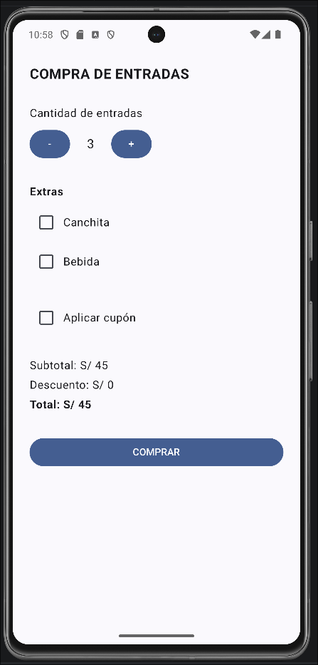
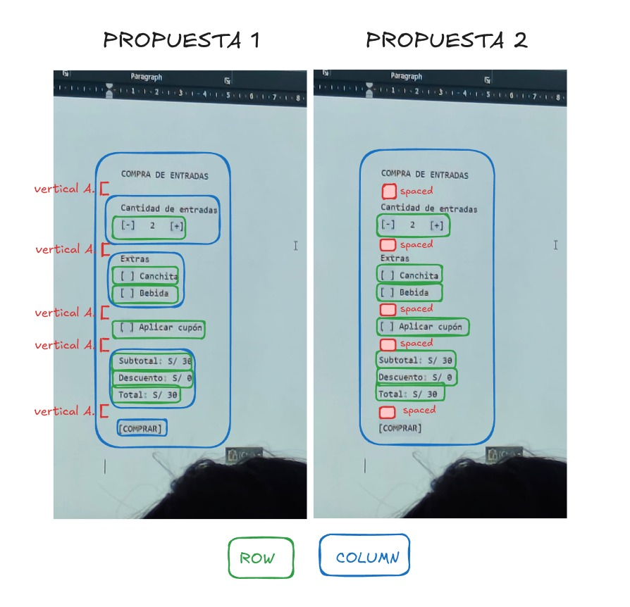
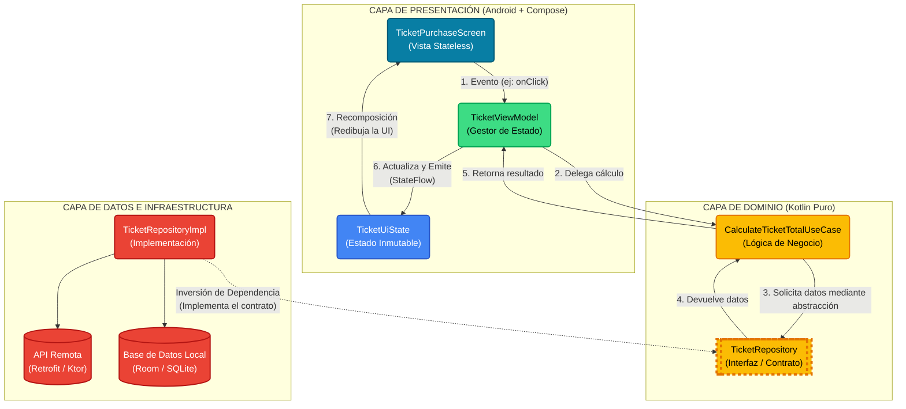

# Cine Diego - Módulo de Compra de Entradas (TicketPurchaseScreen)

Este proyecto corresponde a la implementación y optimización técnica del módulo de venta de entradas para el cine denominado **Diego**, desarrollado en **Android** utilizando **Jetpack Compose** y **Material Design 3**.

El desarrollo se enfoca en la aplicación de las mejores prácticas de la programación declarativa moderna en Android, abordando dos pilares esenciales:
1. **La estructuración y modularización jerárquica de la interfaz de usuario (UI Layout)**.
2. **La optimización del ciclo de vida y reducción de recomposiciones innecesarias mediante `derivedStateOf`**.

---

## Integrantes del Equipo

1. **Arias Quispe, Jhonatan David**
2. **Boza Portilla, Yordano Hernan**
3. **Carbajal Gonzales, Diego Alenjando**
4. **Cari Lipe, Paul Andree**
5. **Mamani Huarsaya, Jorge Luis**

---

## Tabla de Contenidos

- [Integrantes del Equipo](#integrantes-del-equipo)
- [1. Contexto y Requerimientos del Negocio](#1-contexto-y-requerimientos-del-negocio)
  - [Mockup de Requerimientos Inicial](#mockup-de-requerimientos-inicial)
- [2. Evolución y Mejora en la Estructuración de la Interfaz (UI Layout)](#2-evolución-y-mejora-en-la-estructuración-de-la-interfaz-ui-layout)
  - [Estructura Anterior (Propuesta 1: Maquetación Plana e Imperativa)](#estructura-anterior-propuesta-1-maquetación-plana-e-imperativa)
  - [Estructura Implementada (Propuesta 2: Jerarquía Modular y Declarativa)](#estructura-implementada-propuesta-2-jerarquía-modular-y-declarativa)
  - [Comparativa Visual de Propuestas (Mockups)](#comparativa-visual-de-propuestas-mockups)
  - [Comparativa Técnica de Estructuración](#comparativa-técnica-de-estructuración)
  - [Análisis Visual de las Mejoras Introducidas](#análisis-visual-de-las-mejoras-introducidas)
- [3. Optimización de Estado y Recomposición con `derivedStateOf`](#3-optimización-de-estado-y-recomposición-con-derivedstateof)
  - [Fundamentos de Recomposición en Compose](#fundamentos-de-recomposición-en-compose)
  - [El Problema en la Implementación Anterior](#el-problema-en-la-implementación-anterior)
  - [Implementación y Solución con `derivedStateOf`](#implementación-y-solución-con-derivedstateof)
  - [¿Por qué y cómo mejora el rendimiento?](#por-qué-y-cómo-mejora-el-rendimiento)
  - [Reglas de Decisión: Cuándo utilizar `derivedStateOf`](#reglas-de-decisión-cuándo-utilizar-derivedstateof)
- [4. Proyección Arquitectónica (UDF y Clean Architecture)](#4-proyección-arquitectónica-udf-y-clean-architecture)
- [5. Estructura de Archivos y Código Fuente](#5-estructura-de-archivos-y-código-fuente)
- [6. Instrucciones de Compilación y Ejecución](#6-instrucciones-de-compilación-y-ejecución)

---

## 1. Contexto y Requerimientos del Negocio

El objetivo del laboratorio consistió en construir una pantalla interactiva y reactiva para la venta de boletos de cine con las siguientes reglas de negocio:

* **Tarifa Base por Entrada**: S/ 15.00 por ticket (valor inicial: 2 entradas, con límite mínimo de 1 entrada).
* **Selección de Extras (Snacks/Bebidas)**:
  * Canchita: S/ 12.00 adicionales.
  * Bebida: S/ 8.00 adicionales.
* **Cupón de Descuento**: Opción de activar un cupón promocional que aplica un **10% de descuento** sobre el subtotal acumulado.
* **Resumen Dinámico en Tiempo Real**: Cálculo automático y visible del Subtotal, Descuento y Monto Total a pagar.
* **Acción de Compra**: Botón principal interactivo `"COMPRAR"` de ancho completo.

### Mockup de Requerimientos Inicial

La especificación visual provista para el cine **Diego** contempla el diseño base para el flujo de compra de boletos:

<p align="center">
  
  <br>
  <em>Figura 1: Especificación y requerimiento visual de la pantalla de compra de entradas del Cine Diego.</em>
</p>

---

## 2. Evolución y Mejora en la Estructuración de la Interfaz (UI Layout)

Durante el ciclo de desarrollo se evaluaron dos aproximaciones de estructuración visual, pasando de un esquema inicial plano a una arquitectura de layouts jerárquica, limpia y mantenible.

### Estructura Anterior (Propuesta 1: Maquetación Plana e Imperativa)

En la primera versión del código, todos los componentes se encontraban alojados como hijos directos dentro de una única columna raíz:

```kotlin
// Esquema conceptual de la Propuesta 1 (Plana)
Column(
    modifier = modifier.fillMaxSize().padding(24.dp),
    verticalArrangement = Arrangement.spacedBy(12.dp)
) {
    Text(text = "COMPRA DE ENTRADAS", ...)
    Spacer(modifier = Modifier.height(8.dp))
    
    Text(text = "Cantidad de entradas")
    Row { Button("-"); Text(...); Button("+") }
    Spacer(modifier = Modifier.height(8.dp))
    
    Text(text = "Extras", ...)
    Row { Checkbox(...); Text("Canchita") }
    Row { Checkbox(...); Text("Bebida") }
    Spacer(modifier = Modifier.height(8.dp))
    
    Row { Checkbox(...); Text("Aplicar cupón") }
    Spacer(modifier = Modifier.height(16.dp))
    
    Text(text = "Subtotal: ...")
    Text(text = "Descuento: ...")
    Text(text = "Total: ...")
    Spacer(modifier = Modifier.height(16.dp))
    
    Button(onClick = { ... }) { Text("COMPRAR") }
}
```

#### Deficiencias Técnicas de la Propuesta 1:
1. **Acoplamiento de Espaciado Mixto y Arbitrario**: Se combinaba `Arrangement.spacedBy(12.dp)` a nivel global con múltiples llamadas a `Spacer(modifier = Modifier.height(8.dp))` y `Spacer(modifier = Modifier.height(16.dp))`. Esto provocaba una suma de márgenes impredecible e inconsistente entre componentes.
2. **Ausencia de Cohesión Semántica**: Los elementos que conceptualmente forman una unidad (por ejemplo, el título de sección *"Cantidad de entradas"* y la fila con los botones `+`/`-`) estaban dispersos al mismo nivel jerárquico que los separadores y los botones.
3. **Pobre Mantenibilidad y Rigidez**: Reorganizar o mover una sección requería recalcular manualmente la posición y el tamaño de los `Spacer` adyacentes.
4. **Barrera para la Modularización**: Resultaba complejo extraer secciones hacia funciones `@Composable` independientes sin alterar el espaciado exterior impuesto por los `Spacer`.

---

### Estructura Implementada (Propuesta 2: Jerarquía Modular y Declarativa)

La solución final adoptada en [`MainActivity.kt`](app/src/main/java/com/example/diego/MainActivity.kt) estructura la pantalla en **6 secciones lógicas bien delimitadas**, eliminando por completo los `Spacer` manuales y delegando el espaciado a contenedores composables especializados:

```kotlin
// Implementación final en TicketPurchaseScreen
Column(
    modifier = modifier
        .fillMaxSize()
        .padding(24.dp),
    verticalArrangement = Arrangement.spacedBy(32.dp) // Espaciado Macro entre secciones
) {
    // Sección 1: Título Principal
    Column(verticalArrangement = Arrangement.spacedBy(8.dp)) {
        Text(
            text = "COMPRA DE ENTRADAS",
            fontSize = 20.sp,
            fontWeight = FontWeight.Bold
        )
    }

    // Sección 2: Selector de Cantidad de Entradas
    Column(verticalArrangement = Arrangement.spacedBy(8.dp)) {
        Text(text = "Cantidad de entradas")
        Row(verticalAlignment = Alignment.CenterVertically) {
            Button(onClick = { if (ticketCount > 1) ticketCount-- }) { Text("-") }
            Text(
                text = ticketCount.toString(),
                modifier = Modifier.padding(horizontal = 24.dp),
                fontSize = 18.sp
            )
            Button(onClick = { ticketCount++ }) { Text("+") }
        }
    }

    // Sección 3: Extras (Snacks y Bebidas)
    Column(verticalArrangement = Arrangement.spacedBy(8.dp)) {
        Text(text = "Extras", fontWeight = FontWeight.Bold)
        Row(verticalAlignment = Alignment.CenterVertically) {
            Checkbox(checked = hasCanchita, onCheckedChange = { hasCanchita = it })
            Text("Canchita")
        }
        Row(verticalAlignment = Alignment.CenterVertically) {
            Checkbox(checked = hasBebida, onCheckedChange = { hasBebida = it })
            Text("Bebida")
        }
    }

    // Sección 4: Descuento / Cupón
    Column(verticalArrangement = Arrangement.spacedBy(8.dp)) {
        Row(verticalAlignment = Alignment.CenterVertically) {
            Checkbox(checked = hasCoupon, onCheckedChange = { hasCoupon = it })
            Text("Aplicar cupón")
        }
    }

    // Sección 5: Resumen de Cobro
    Column(verticalArrangement = Arrangement.spacedBy(4.dp)) {
        Text(text = "Subtotal: S/ ${subtotal.toInt()}")
        Text(text = "Descuento: S/ ${discount.toInt()}")
        Text(text = "Total: S/ ${total.toInt()}", fontWeight = FontWeight.Bold)
    }

    // Sección 6: Botón de Acción Principal
    Column(verticalArrangement = Arrangement.spacedBy(8.dp)) {
        Button(
            onClick = { /* Acción al comprar */ },
            modifier = Modifier.fillMaxWidth()
        ) {
            Text("COMPRAR")
        }
    }
}
```

#### Mejoras Introducidas y Beneficios:
* **Separación de Niveles de Espaciado (Macro vs. Micro Layout)**:
  * **Nivel Macro (Inter-seccional)**: La `Column` raíz impone `Arrangement.spacedBy(32.dp)`, estableciendo un ritmo visual uniforme y aireado entre cada una de las 6 secciones.
  * **Nivel Micro (Intra-seccional)**: Cada subcolumna maneja su propio espaciado interno compacto (`8.dp` para títulos y controles, y `4.dp` para el desglose financiero del resumen).
* **Eliminación Total de `Spacer` de Relleno**: El diseño es 100% declarativo. Si una sección no se renderiza o se traslada, el espaciado restante se ajusta automáticamente sin dejar huecos en blanco.
* **Alta Cohesión y Bajo Acoplamiento**: Cada bloque funcional actúa como un módulo autónomo, lo que facilita su posterior refactorización hacia componentes reutilizables o pruebas visuales aisladas con `@Preview`.
* **Alineación Ergonómica**: Se aprovechan modificadores nativos como `Alignment.CenterVertically` en las filas de `Checkbox` y controles numéricos para asegurar simetría visual precisa.

---

### Comparativa Visual de Propuestas (Mockups)

Como se describe en las notas técnicas, aunque ambas propuestas obtienen un resultado visual exteriormente similar, la estructura interior está orientada a diferentes alcances técnicos y niveles de escalabilidad:

<div align="center">

| Propuesta 1 (Maquetación Plana e Imperativa) | Propuesta 2 (Jerarquía Modular y Declarativa) |
| :---: | :---: |
|  |  |
| <em>Estructura rígida con Spacers manuales y cálculos imperativos directos.</em> | <em>Estructura modular en 6 subsecciones con <code>Arrangement.spacedBy</code> y <code>derivedStateOf</code>.</em> |

</div>

---

### Comparativa Técnica de Estructuración

| Criterio | Propuesta Anterior (Plana) | Propuesta Implementada (Modular) | Impacto Técnico |
| :--- | :--- | :--- | :--- |
| **Jerarquía del Árbol Compose** | 1 nivel plano con múltiples hijos sueltos | 2 niveles semánticos (Raíz + 6 Subsecciones) | Mayor claridad conceptual y jerarquía visual estricta |
| **Manejo del Espacio Vertical** | Combinación desordenada de `spacedBy(12.dp)` y `Spacer(...)` | Jerárquico: `spacedBy(32.dp)` macro y `spacedBy(8.dp/4.dp)` micro | Espaciado uniforme, predecible y escalable |
| **Uso de `Spacer`** | 6 instancias manuales | 0 instancias | Reducción de nodos innecesarios en el árbol de composición |
| **Mantenibilidad** | Frágil al modificar o reordenar bloques | Modular; cada sección se altera sin efectos colaterales | Menor costo de mantenimiento y refactorización |
| **Preparación para Clean UI** | Baja | Alta; preparado para extraer subcomposables independientes | Código alineado a estándares de producción Android |

---

### Análisis Visual de las Mejoras Introducidas

En el siguiente mockup de análisis técnico se desglosan en detalle las modificaciones estructurales y de optimización introducidas en la Propuesta 2:

<p align="center">
  
  <br>
  <em>Figura 2: Análisis técnico y descomposición de las mejoras aplicadas en la Propuesta 2 (secciones modulares y estado derivado).</em>
</p>

---

## 3. Optimización de Estado y Recomposición con `derivedStateOf`

### Fundamentos de Recomposición en Compose

En Jetpack Compose, el runtime observa las lecturas de los objetos `State<T>`. Cuando el valor de un estado cambia, Compose agenda y ejecuta nuevamente todas las funciones composables (o ámbitos de recomposición) que leyeron ese estado, recalculando la interfaz para reflejar los nuevos datos.

### El Problema en la Implementación Anterior

En la propuesta preliminar, los cálculos de precio se declaraban como variables locales directas en el cuerpo de la función composable:

```kotlin
// Enfoque Anterior (Cálculo directo en cada pase de recomposición)
val subtotal = (ticketCount * ticketPrice) + 
               (if (hasCanchita) canchitaPrice else 0.0) + 
               (if (hasBebida) bebidaPrice else 0.0)

val discount = if (hasCoupon) subtotal * 0.10 else 0.0 
val total = subtotal - discount
```

#### Problemas de Rendimiento y Arquitectura:
1. **Recálculo Forzado en Cada Recomposición**: Cualquier evento que provoque la recomposición de `TicketPurchaseScreen` (por ejemplo, animaciones, cambios de foco, eventos del teclado o recomposiciones inducidas por componentes padre) forzaba a reejecutar todas las operaciones aritméticas de multiplicación, comparación condicional y resta, aun cuando ninguna de las variables involucradas (`ticketCount`, `hasCanchita`, `hasBebida`, `hasCoupon`) hubiera cambiado.
2. **Pérdida de Reactividad Granular**: Al ser valores primitivos planos (`Double`), Compose no tiene forma de saber cuándo el resultado cambia o se mantiene idéntico. En una pantalla más compleja, no es posible suscribir composables hijos únicamente al resultado final; deben depender del ámbito completo.

---

### Implementación y Solución con `derivedStateOf`

En la solución definitiva implementada, cada cálculo dinámico se encapsuló utilizando la combinación `remember { derivedStateOf { ... } }`:

```kotlin
// Cálculos dinámicos optimizados con derivedStateOf
val subtotal by remember {
    derivedStateOf {
        (ticketCount * ticketPrice) +
                (if (hasCanchita) canchitaPrice else 0.0) +
                (if (hasBebida) bebidaPrice else 0.0)
    }
}

val discount by remember {
    derivedStateOf {
        if (hasCoupon) subtotal * 0.10 else 0.0
    }
}

val total by remember {
    derivedStateOf {
        subtotal - discount
    }
}
```

### ¿Por qué y cómo mejora el rendimiento?

El uso de `derivedStateOf` aporta optimizaciones determinantes en el runtime de Compose:

1. **Rastreo Automático de Dependencias (Snapshot State Tracking)**:
   * Durante la fase de composición, el bloque dentro de `derivedStateOf` se suscribe automáticamente a las lecturas de los `State` subyacentes (`ticketCount`, `hasCanchita`, `hasBebida`, `hasCoupon`). Compose construye internamente un grafo de dependencias reactivas.
2. **Caché y Memoización**:
   * Mediante `remember`, la instancia del estado derivado persiste a lo largo de las recomposiciones. Si `TicketPurchaseScreen` se recompone por factores ajenos a los precios (como redibujado de la pantalla o cambios de configuración local), Compose **no reejecuta** el bloque de cálculo: reutiliza instantáneamente el valor memoizado.
3. **Filtro Selectivo de Recomposición (Dampening / Buffering)**:
   * `derivedStateOf` evalúa si el resultado final de la expresión ha mutado con respecto a su valor anterior mediante igualdad estructural (`equals`).
   * **Solo cuando el resultado numérico calculado realmente cambia**, el runtime de Compose invalida los ámbitos de lectura dependientes (en este caso, los `Text` de la Sección 5: Resumen de Cobro).
4. **Encadenamiento Reactivo Óptimo**:
   * `discount` observa a `subtotal`, y `total` observa tanto a `subtotal` como a `discount`. Cuando cambia un snack o el contador de boletos, la cascada de derivación se propaga limpiamente en orden topológico sin generar ciclos redundantes de recomposición.
5. **Conservación de la Tasa de Cuadros (60 / 120 FPS)**:
   * Al descargar al hilo principal (UI Thread) de cálculos matemáticos repetitivos, se previenen caídas de cuadros (*frame drops* o *jank*), garantizando una experiencia de usuario completamente fluida.

---

### Reglas de Decisión: Cuándo utilizar `derivedStateOf`

| Escenario | ¿Usar `derivedStateOf`? | Justificación Técnica |
| :--- | :---: | :--- |
| **Cálculo a partir de uno o más `State` cuyo resultado muta menos veces que sus entradas** | **SÍ** | Filtra recomposiciones hacia composables hijos aguas abajo. |
| **Operaciones que combinan múltiples estados observables para generar un valor compuesto** | **SÍ** | Memoiza la expresión y crea una fuente única de verdad reactiva (`subtotal`, `total`). |
| **Cálculos costosos dentro del hilo de interfaz (filtrado de listas grandes, transformaciones)** | **SÍ** | Evita recalcular en cada frame durante recomposiciones del contenedor. |
| **Derivar de variables primitivas estáticas que no son `State`** | **NO** | No hay observables que rastrear; basta con un simple `remember(key) { ... }`. |
| **Lectura directa de un único estado sin transformación ni combinación** | **NO** | No aporta valor; añade sobrecarga de asignación de objetos sin beneficio. |

---

## 4. Proyección Arquitectónica (UDF y Clean Architecture)

Siguiendo la documentación técnica de referencia del proyecto, la evolución natural de este componente hacia una arquitectura de nivel de producción consiste en aplicar el patrón **MVVM + Clean Architecture** junto al principio de **Flujo Unidireccional de Datos (UDF)**:



### Principios de la Proyección:
* **UI Stateless**: La pantalla `TicketPurchaseScreen` recibe un `TicketUiState` inmutable y emite lambdas hacia el `ViewModel` (`onIncrementTicket`, `onToggleCanchita`, etc.).
* **State Hoisting**: Elevar el estado hacia el ViewModel desacopla por completo la interfaz gráfica de la lógica de negocio y permite realizar pruebas unitarias sobre los cálculos sin necesidad de emulador ni runtime de Android.

---

## 5. Estructura de Archivos y Código Fuente

El proyecto se encuentra organizado en el módulo estándar de aplicación Android:

```text
assignments/Diego/
├── app/
│   ├── build.gradle.kts                 # Configuración de dependencias (Compose Material3, AndroidX)
│   └── src/
│       ├── main/
│       │   ├── AndroidManifest.xml      # Manifiesto de la aplicación Android
│       │   └── java/com/example/diego/
│       │       ├── MainActivity.kt      # Implementación de TicketPurchaseScreen y Theme Scaffold
│       │       └── ui/theme/            # Configuración de Material Theme
│       │           ├── Color.kt         # Paleta de colores primarios y secundarios
│       │           ├── Theme.kt         # Definición de DiegoTheme (Material3)
│       │           └── Type.kt          # Escala tipográfica
│       └── test/                        # Pruebas unitarias de JVM
├── build.gradle.kts                     # Configuración raíz de plugins de Gradle
├── gradle/libs.versions.toml             # Catálogo de versiones centralizado (Version Catalog)
└── README.md                            # Documentación técnica integral del módulo
```

---

## 6. Instrucciones de Compilación y Ejecución

### Requisitos Previos
* **Android Studio**: Ladybug / Jellyfish o versión compatible con Gradle 8.x / 9.x.
* **JDK**: Versión 17 o superior.
* **Android SDK**: `compileSdk = 35`, `minSdk = 24`.

### Compilación desde Línea de Comandos
Para validar la correcta compilación del código Kotlin y Compose en el módulo `Diego`:

```bash
cd /home/george/George/I_programmer/University/4_year/2_semester/introduction_to_the_development_of_new_platforms/assignments/Diego
./gradlew compileDebugKotlin
```

### Previsualización en Android Studio
La pantalla cuenta con un composable de previsualización para inspección visual directa sin desplegar en dispositivo:

```kotlin
@Preview(showBackground = true)
@Composable
fun TicketPurchaseScreenPreview() {
    DiegoTheme {
        TicketPurchaseScreen()
    }
}
```
